# Breed Explorer

A high-performance, offline-first Expo React Native application for browsing, filtering, and exploring a comprehensive list of 283 dog breeds.

## Quick Start

Get the project running locally in under 3 minutes.

```bash
# 1. Install dependencies
npm install

# 2. Set up environment variables
cp .env.example .env

# 3. Start the application
npm run ios
# or
npm run android
```

The current API client uses the public Dog API URL directly and does not require environment variables at runtime. The `.env` copy step is retained as the project setup contract; add `.env.example` when environment-specific configuration is introduced.

Available commands:

```bash
npm test       # Run Jest and React Native Testing Library tests
npm run start  # Start the Expo development server
npm run web    # Start the web target
```

## Architecture Overview

Breed Explorer is built on Expo SDK 57, React Native, TypeScript, and React Navigation. The list screen reads normalized breed records from a local SQLite database, applies search and filter state locally, and renders results with Shopify FlashList. The detail screen receives the selected record through typed navigation and exposes Overview, Traits, and Gallery tabs.

Synchronization is cache-first. On query execution, the app initializes SQLite, fetches all pages from the Dog API concurrently, saves the response in one transaction, and then reads the local database as the UI-facing source of truth. If the request fails, the existing cache is still returned, allowing previously synchronized breeds to remain available offline.

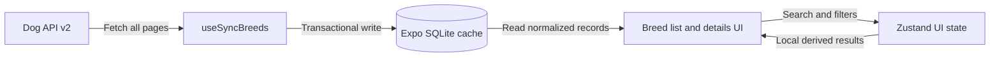

### Data flow

`API -> Cache -> UI`

1. `src/api/dogApi.ts` fetches all paginated breed records.
2. `src/hooks/useSyncBreeds.ts` coordinates refresh, fallback, and query state.
3. `src/db/database.ts` persists records in `tripare_dogs.db` and maps them to `BreedItem` values.
4. `BreedListScreen` derives local search and filter results, then passes selected records to `BreedDetailsScreen`.

## Key Technical Decisions

### State management: Zustand and TanStack Query

Zustand stores UI state that is shared by the search input and filter modal: search text, breed groups, sizes, coat lengths, hypoallergenic mode, and trait thresholds. It is small and direct, which keeps filter updates easy to follow without duplicating server data.

TanStack Query owns asynchronous synchronization state such as loading, fetching, and errors. Keeping server synchronization separate from UI filter state prevents the store from becoming a second source of truth for breed data.

### Database: Expo SQLite

Expo SQLite provides durable on-device storage and transactional writes for the 283-record dataset. Frequently used fields are stored in columns, while the complete API record is retained as JSON so nested traits, measurements, image galleries, and attribution remain available to the details screen.

### Offline sync strategy

The app uses a stale-while-revalidate style flow:

1. Initialize the local database.
2. Attempt a fresh API fetch with a 10-second timeout.
3. Replace cached rows in a SQLite transaction when fresh data is available.
4. Read the database for display in both online and offline states.
5. If the network request fails, keep showing cached records and display the offline banner.

Search is local and debounced by 300 ms, so it remains responsive without requiring network access.

## Performance Report

### Bundle size breakdown

The repository does not contain a release build artifact, so exact compressed bundle sizes must be measured from the target iOS or Android build. The current dependency and application breakdown is:

| Area | Contents | Measurement status |
| --- | --- | --- |
| Core runtime | Expo SDK 57, React Native 0.86, React 19 | Build-dependent |
| UI and list rendering | React Navigation, FlashList, safe-area support | Build-dependent |
| Data and persistence | Axios, TanStack Query, Zustand, Expo SQLite | Build-dependent |
| Application code and assets | TypeScript screens, components, images, and app assets | Build-dependent |
| Total | Release binary and JavaScript bundle | Not measured in this repository |

For a comparable report, build a release variant and record the JavaScript bundle, native binary, and packaged assets separately. Development builds are not representative of production size.

### Rendering and interaction performance

- **Full list:** FlashList virtualizes rows and uses stable breed IDs as keys, limiting mounted list content while browsing all 283 breeds.
- **Filtering:** Search is debounced by 300 ms and derived with `useMemo`, avoiding a full filter pass on every keystroke.
- **List rows:** Breed cards are memoized and use fixed image dimensions to reduce unnecessary layout work.
- **Detail gallery:** Gallery images are mounted only when the Gallery tab is selected and are rendered with a horizontal `FlatList`.
- **FPS during interactions:** The target is 60 FPS during scrolling, filtering, navigation, and gallery paging. No device profiler capture is checked into this repository, so this remains a target rather than a measured result.

### Profiler screenshot: full 283-breed list render

No profiler screenshot is included in the supplied assets. Measure a release build while scrolling from the first to the last breed and attach the capture here when available.

### Memory usage screenshot

No memory usage screenshot is included in the supplied assets. Record peak memory during a full-list scroll and gallery transition on both a simulator and a physical device before publishing a measured value.

## Screenshots

The supplied captures cover the main browsing, filtering, traits, and gallery flow in both light and dark mode. The app follows the device color scheme by default and also exposes a Light/Dark toggle in the navigation header. The offline behavior is implemented, but no offline-state capture was supplied.

### Breed list

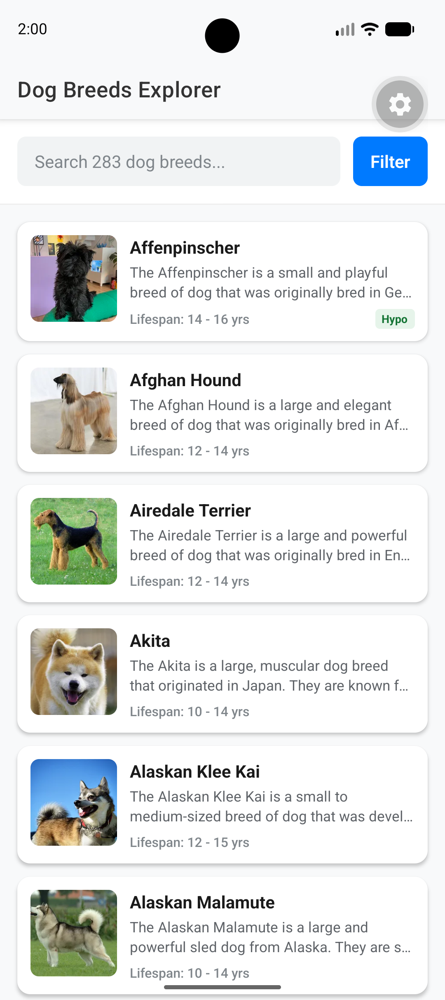

### Search results

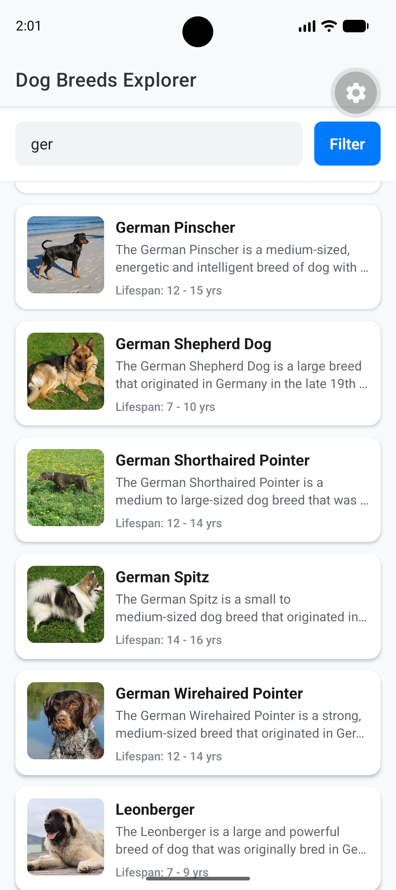

### Filters

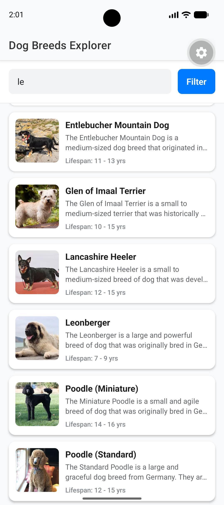

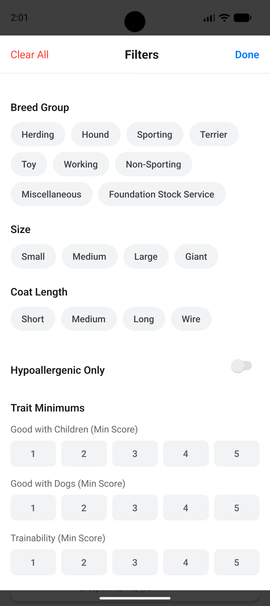

### Detail screen with traits

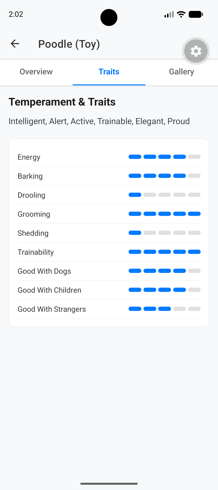

### Detail screen gallery

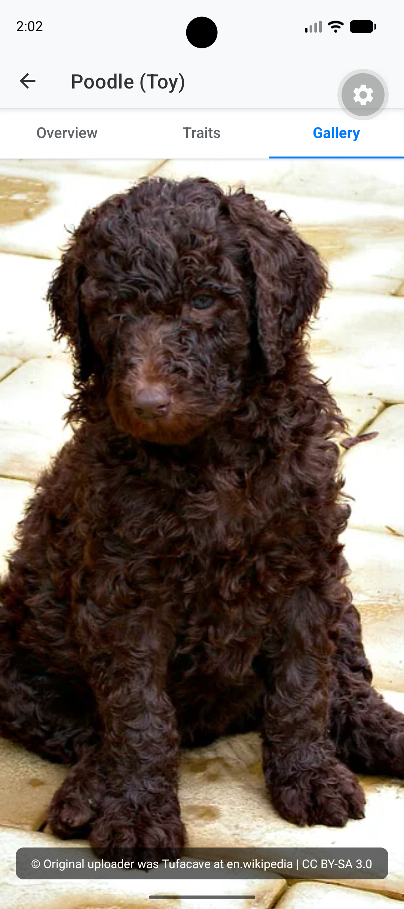

### Dark mode

#### Breed list

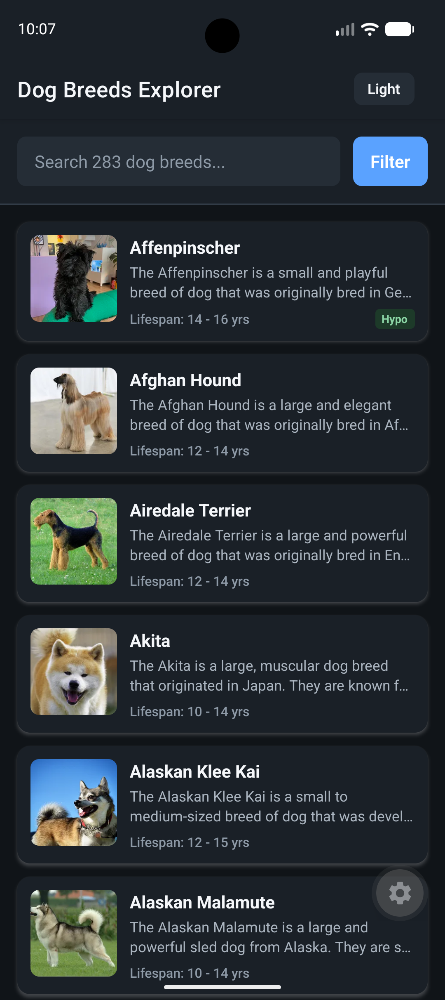

#### Filtered breed list

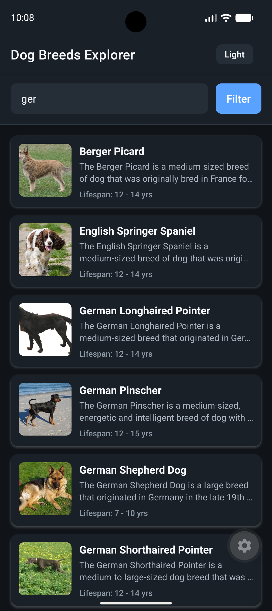

#### Active filters

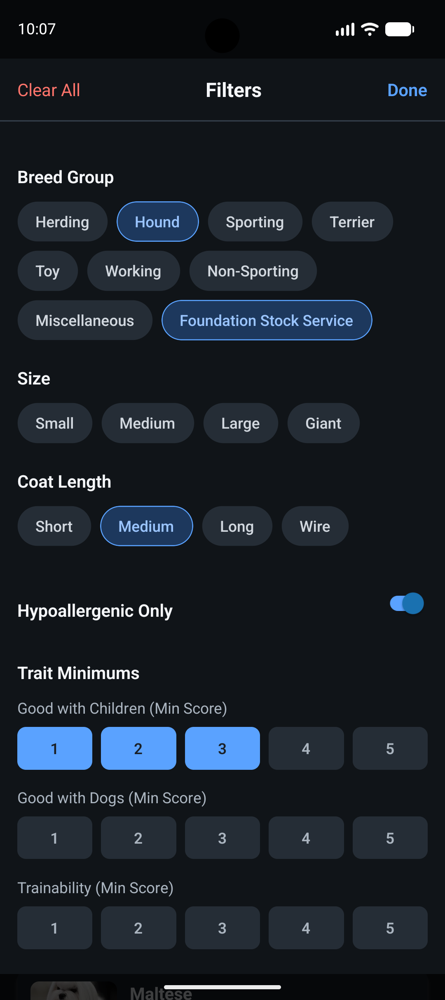

#### Detail screen with traits

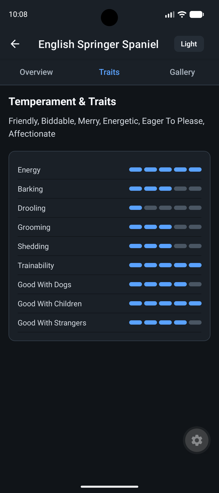

#### Detail screen gallery


## Testing

Run the screen-level tests with:

```bash
npm test
```

The test suites cover list loading and filtering, navigation, detail tabs, trait rendering, and gallery behavior. Network synchronization, SQLite, and list virtualization are kept behind mocked boundaries so the tests remain deterministic.

## Project Documentation

- [Architecture](docs/ARCHITECTURE.md)
- [Technical decisions](docs/DECISIONS.md)
- [Performance guide](docs/PERFORMANCE.md)
