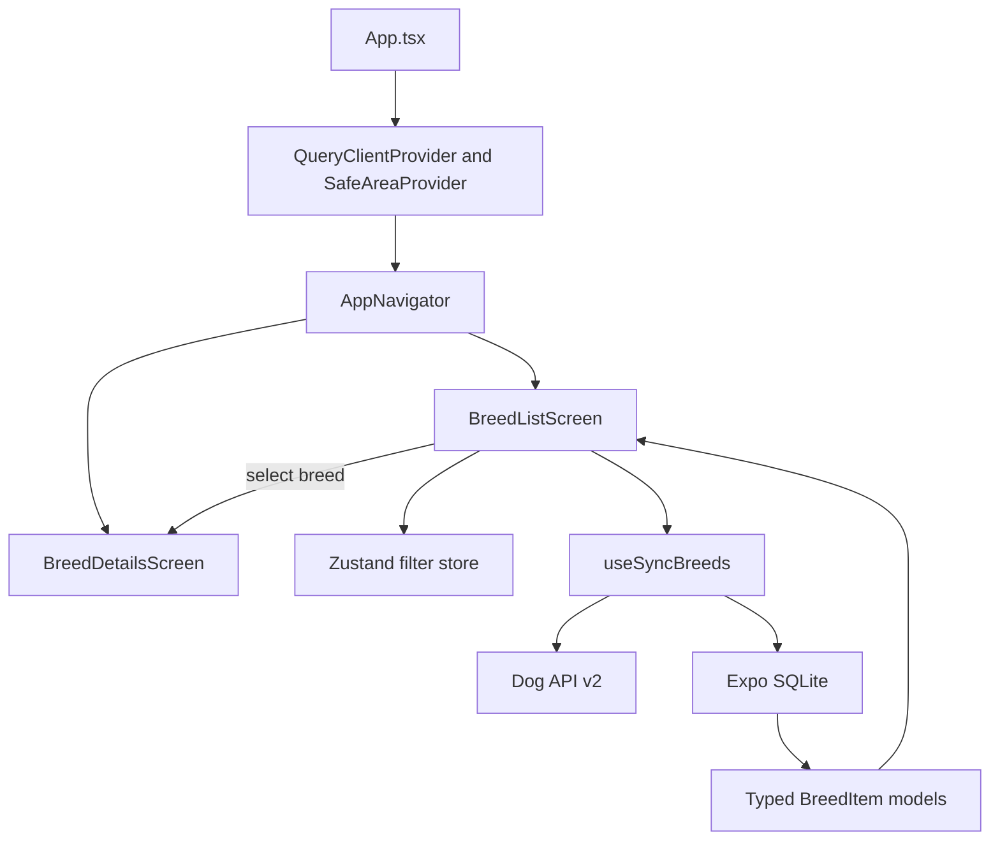

# Dog Breeds Explorer Architecture

## Overview

The app is an Expo React Native application with an offline-first data flow:

1. Fetch breed and group data from the Dog API.
2. Persist the response in Expo SQLite with sync metadata.
3. Read the local database into normalized `BreedItem` records.
4. Render the list and detail screens from the local data.
5. Apply search and filter state locally for responsive interaction.

The local database is the source used by the UI after synchronization. If the network is unavailable, the sync hook falls back to cached records.

## Project Structure

```text
tripare-dog-breeds/
|-- App.tsx                         # App providers and root navigation
|-- index.ts                        # Expo entry point
|-- app.json                        # Expo app configuration
|-- package.json                    # Scripts and dependencies
|-- assets/                         # Static app assets
|-- docs/
|   |-- ARCHITECTURE.md             # This document
|   |-- DECISIONS.md                # Technical decisions and rationale
|   `-- PERFORMANCE.md              # Performance notes
`-- src/
		|-- api/
		|   `-- dogApi.ts                # Dog API client and pagination
		|-- components/
		|   |-- BreedCard.tsx            # List item presentation
		|   |-- FilterModal.tsx           # Filter controls
		|   `-- TraitBar.tsx              # Trait score presentation
		|-- db/
		|   `-- database.ts               # SQLite schema and persistence
		|-- hooks/
		|   |-- useDebounce.ts            # Delays search updates
		|   `-- useSyncBreeds.ts          # Network, cache, and query orchestration
		|-- navigation/
		|   `-- AppNavigator.tsx          # Typed native stack navigation
		|-- screens/
		|   |-- BreedListScreen.tsx       # Searchable, filterable breed list
		|   `-- BreedDetailsScreen.tsx    # Overview, traits, and gallery tabs
		|-- store/
		|   `-- useBreedStore.ts          # Zustand filter state
		|-- types/
		|   |-- dog.ts                    # API and normalized breed models
		|   `-- navigation.ts              # Navigation route types
		|-- utils/
		|   `-- formatters.ts              # Shared display formatting helpers
		`-- __tests__/
				|-- BreedList.test.tsx        # Breed list behavior tests
				`-- BreedDetails.test.tsx     # Breed details behavior tests
```

## Runtime Architecture



## Layer Responsibilities

### Application and navigation

- `App.tsx` creates the TanStack Query client and mounts the safe-area and navigation providers.
- `AppNavigator.tsx` owns the typed `BreedList` and `BreedDetails` routes.
- Screens own screen-level state and compose reusable components.

### API and synchronization

- `src/api/dogApi.ts` uses Axios against `https://dogapi.dog/api/v2`.
- All paginated breed pages are fetched in 48-record pages and merged before persistence.
- `GET /groups` populates the local groups table and `GET /breeds/:id` is available for detail refreshes.
- `src/hooks/useSyncBreeds.ts` initializes SQLite, attempts a fresh network sync, then returns database records.
- Foreground and network-reconnection events trigger refreshes with exponential retry.
- A failed network request does not prevent cached data from being displayed.

### Persistence

- `src/db/database.ts` creates the `breeds` table when needed.
- Frequently used fields such as `id`, `name`, `group_id`, and `hypoallergenic` are stored in columns.
- The complete API record is stored as JSON in `data` so nested traits, images, and measurements are retained.
- The `groups` table stores filter labels and `sync_metadata` stores `lastSyncedAt`.
- `getBreedsFromDb()` maps database rows into the UI-facing `BreedItem` model.

### State and presentation

- TanStack Query manages the asynchronous synchronization lifecycle.
- Zustand stores search text and filter selections shared by list controls.
- `useDebounce` prevents filtering on every keystroke.
- `BreedListScreen` performs local search and filter derivation before rendering the virtualized list.
- `BreedDetailsScreen` presents the selected record in Overview, Traits, and Gallery tabs.

## Data Flow

```text
Dog API
	-> fetchAllBreeds()
	-> useSyncBreeds()
	-> saveBreedsToDb()
	-> getBreedsFromDb()
	-> BreedItem[]
	-> BreedListScreen
	-> BreedCard
	-> BreedDetailsScreen
```

The list screen passes the complete selected `BreedItem` through the typed navigation route. The details screen reads `rawAttributes` for nested measurements, traits, and gallery metadata.

## Testing Strategy

Tests use Jest with `jest-expo` and React Native Testing Library. Network access, SQLite, and virtualization are kept outside the screen tests by mocking synchronization and list boundaries. The screen suites focus on observable behavior such as loading, filtering, navigation, tab content, empty states, and gallery attribution.
